# Neural-Augmented Self-Modeling Agents Framework
> **Meta-Cognitive AI · Adaptive Agents · Modular Architecture**  
> *Published on: 27 June 2025*

## Author 
{:.author-section}
**By Hector Mozo**  

**Affiliations:**  
- Department of Computer Science, University of the People, California, USA  
- NeureonMindFlux Research Lab 

📧 **University Email:** [HectorMozo@my.uopeople.edu](mailto:HectorMozo@my.uopeople.edu)  
📧 **Institutional Email:** [hector.mozo@neureonmindflux.org](mailto:contact@neureonmindflux.org)

## Abstract {#abstract}
The Neural-Augmented Self-Modeling Agents Framework is a modular system that enables artificial agents to analyze and adapt their own internal cognitive states in real time. It uses neural models to monitor variables such as confidence, fatigue, and behavioral mode, and employs a meta-learner to interpret these signals and support introspective adjustments. Designed for both single-agent and multi-agent environments, the framework helps agents improve behavioral stability, manage exploration-exploitation balance, and exhibit measurable forms of self-awareness. It includes tools for scientific visualization, reproducible metrics, and flexible configuration, offering a practical platform for research in meta-cognitive AI and adaptive intelligent systems.

## 1.Statement of Need
As artificial intelligence systems become more autonomous and embedded in real-world environments, the ability for agents to analyze and adapt their own internal cognitive states—such as confidence, fatigue, and behavioral mode—has become essential for building resilient and trustworthy systems[^1],[^2]. While theoretical models in cognitive science and AI have explored self-monitoring and introspective processes[^3],[^4], practical tools that implement these capabilities remain scarce.

Recent studies in meta-cognitive frameworks and self-organizing systems have shown that agents capable of observing and interpreting their own behavior can improve decision-making stability and adaptability[^5],[^6]. However, most open-source platforms still focus on externally supervised behavior, lacking mechanisms for internal feedback and self-regulation.

The Neural-Augmented Self-Modeling Agents Framework addresses this gap by offering a practical, modular system where agents can introspectively analyze their internal dynamics and adjust in real time. This design enables the study and deployment of agents with emergent self-awareness and adaptive autonomy across diverse environments and applications[^7].

## 2.Software description
The Neural-Augmented Self-Modeling Agents Framework is structured around a modular architecture designed for transparency, adaptability, and scientific reproducibility. Each component is independently configurable, enabling researchers and developers to experiment with various levels of introspection, adaptation, and coordination. The system supports both single-agent and multi-agent setups, and its internal communication is structured to simulate cognitive autonomy rather than centralized control.

### 2.1 Architecture Overview
At its core, the framework is composed of four main modules:

At its core, the framework is composed of four main modules:

- **Agent Core**  
  Handles perception, basic behavior selection, and interaction with the environment. This module remains intentionally agnostic of the internal state modeling, maintaining a separation between reactive and introspective processes.

- **Self-Monitoring Subsystem**  
  Collects and updates internal cognitive variables such as `confidence`, `fatigue`, and `behavioral_mode`. These variables reflect the agent’s operational state and are observable both internally and externally.

- **Meta-Learner Module**  
  Acts as an introspective analyzer. It receives inputs from the self-monitoring subsystem and dynamically interprets them to recommend behavioral adjustments. It does not enforce control, but rather informs decisions based on learned patterns.

- **Visualization and Export Tools**  
  Provide real-time dashboards, introspection logs, and scientific metric tracking. The system outputs structured data that can be used for reproducible experiments, publications, or AI behavior auditing.


**Figure 1. Modular architecture of the Neural-Augmented Self-Modeling Agent Framework**  
*The diagram illustrates the separation between the agent core, internal self-monitoring subsystem, meta-learner module, and instrumentation layer for real-time analysis and output export.*

### 2.2 Self-Monitoring and Internal Variables

Each agent in the framework continuously monitors its internal cognitive dynamics through a dedicated self-observation module. This subsystem tracks three primary variables:

- `confidence`: a dynamic estimate of decision reliability.  
- `fatigue`: a measure of cognitive resource depletion or overload.  
- `behavioral_mode`: a categorical signal representing current strategic intent (e.g., explore vs. exploit).

These variables evolve during interaction and are updated based on observed outcomes. They are made explicitly available for both internal decision processes and external visualization. Researchers can access them in real time or export them for offline analysis, enabling precise evaluation of agent cognition and adaptation over time.


**Figure 2. Self-Monitoring Architecture**  
*This figure highlights internal modules used by each agent to compute and visualize `confidence`, `fatigue`, and `behavioral_mode` in real time. Modules D3.1 and D3.2 represent simple and advanced self-models, while F1 connects to the real-time dashboard.*

---

### 2.3 Meta-Learner Module

The meta-learner is a central analytic component that interprets internal state variables without enforcing behavioral decisions. It operates independently from the core controller, analyzing trends in `confidence`, `fatigue`, and `behavioral_mode` to detect anomalies, phase shifts, or potential adaptation triggers.

Rather than issuing commands, the meta-learner provides meta-level feedback that agents can use to self-modulate. This separation of analysis and execution promotes interpretability and enables comparative studies across different agent architectures. The module is fully agnostic to the specific implementation of the agents, making it reusable and extensible.


**Figure 3. Meta-Learner Architecture**  
*The meta-learner receives internal signals and generates interpretive feedback. Submodules C1–C4 handle trend analysis, behavioral evaluation, and anomaly detection.*

---

### 2.4 Multi-Agent Support

The framework supports environments populated with multiple self-modeling agents running in parallel. Each agent maintains its own internal self-model, meta-learner process, and behavioral regulation loop, operating autonomously without requiring direct communication.

This design enables the study of emergent coordination, implicit alignment, and distributed meta-cognitive dynamics. Researchers can run controlled experiments where heterogeneous agents independently adapt to shared or individual environments, opening new directions in collaborative autonomy and adaptive swarm intelligence.


**Figure 4. Multi-Agent Parallel Operation**  
*Each agent operates with independent self-models and introspection logic. Modules E1–E3 show concurrent loops, and F2 enables inter-agent metrics aggregation.*

---

### 2.5 Instrumentation and Output

To facilitate scientific reproducibility and rigorous evaluation, the framework includes robust instrumentation tools:

- Real-time dashboards for monitoring cognitive state evolution  
- Internal logs of variable updates and meta-learner analyses  
- Export options in CSV, JSON, and structured logs for offline analysis  
- Visualization modules for time-series introspection and behavioral annotation  

These outputs provide clear insight into each agent’s internal processes and support transparent, data-driven analysis of learning dynamics and self-awareness metrics.


**Figure 5. Scientific Instrumentation and Output Modules**  
*Modules F3 and G1–G3 provide structured visualization, logging, and export functionality for reproducibility, publication, and large-scale experiment tracking.*

#### 2.5.1 Dashboard and GUI Controller

The framework includes an optional graphical user interface (GUI) that serves as a control console for running experiments, selecting configurations, executing the meta-learner, and visualizing results—**without requiring direct interaction with the codebase**. While every core module can operate independently through scripts, the GUI provides a unified and user-friendly interface for streamlined experimentation.

Key capabilities include:

- **Single-Agent Experiment Execution**  
  - Select between Simple or Advanced Self-Model variants  
  - Choose policy types (Dummy, Hybrid, or RL-based)  
  - Launch gridworld experiments and generate outputs

- **Multi-Agent Experiment Launcher**  
  - Define the number of agents and configurations  
  - Execute synchronized introspective agents in parallel  
  - Compare adaptive behavior across populations

- **Meta-Learner Module Integration**  
  - Aggregate internal metrics across runs  
  - Visualize confidence calibration and behavioral shifts

- **Scientific Visualizers**  
  - Multi-agent visual dashboards (confidence and fatigue dynamics)  
  - Self-model deep introspection per configuration

Although the GUI is not required, it significantly simplifies access for researchers and educators. All modules remain fully functional as standalone components in the code, ensuring reproducibility and flexibility for advanced users.

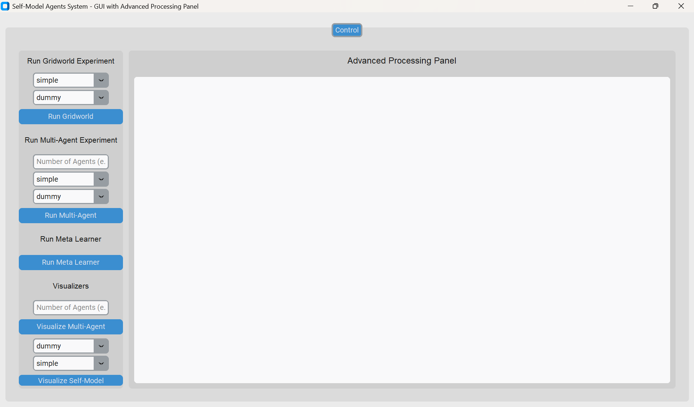

**Figure 6. Optional GUI Controller**  
*The GUI enables graphical control over experiments, self-modeling settings, and introspective analytics. It complements but does not replace the programmatic modular structure of the system.*

#### 2.5.2 Visual Output Samples

To support deep scientific analysis and transparent introspection, the system exports high-resolution visualizations of internal agent processes, meta-learner metrics, and population-wide behavioral dynamics. These outputs are suitable for inclusion in publications, dashboards, or further computational analysis.

#### Introspective State Evolution

This visualization shows the time evolution of internal variables (`confidence`, `fatigue`, and `behavioral_mode`) for a self-modeling agent.

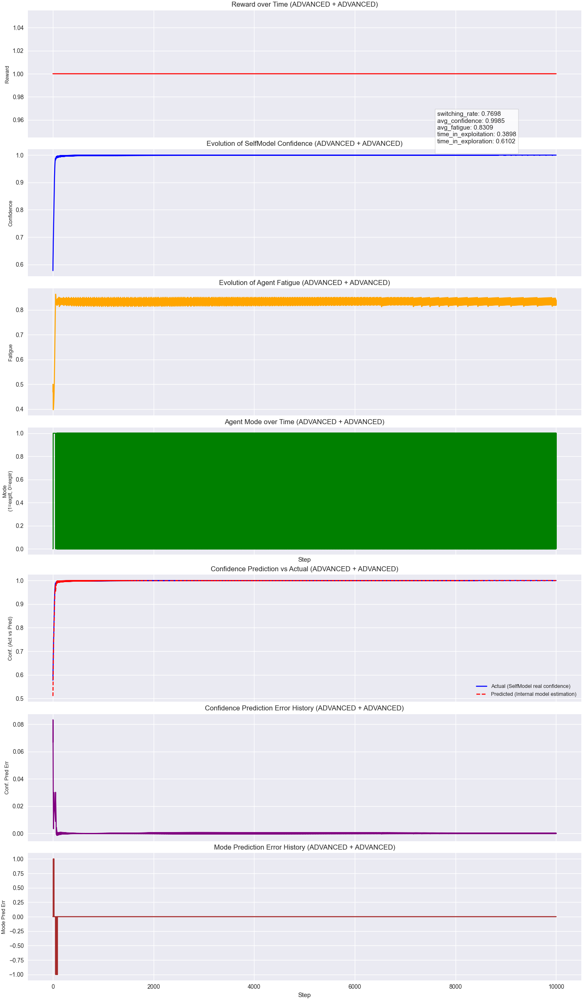  
**Figure 7. Internal cognitive state evolution of an advanced self-model agent.**  
*The timeline captures fine-grained dynamics of internal states as the agent interacts with its environment.*

####  Multi-Agent Cognitive Dynamics

In multi-agent experiments, the system can compare behavioral dynamics across agents. The figure below shows agent modes over time.

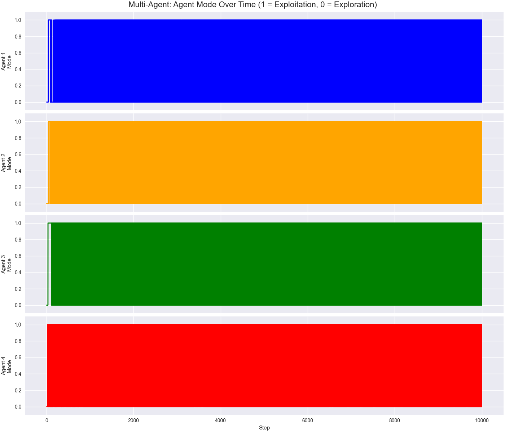  
**Figure 8. Mode switching across agents in a synchronized gridworld environment.**  
*Each line represents an agent’s dominant behavioral mode over time, revealing emergent divergence or synchronization.*

#### Meta-Learner Insight Aggregation

The meta-learner collects and analyzes data across agent runs to reveal trends and adjust introspective recommendations. Several perspectives are provided:

- **Agent-Level Comparison**

  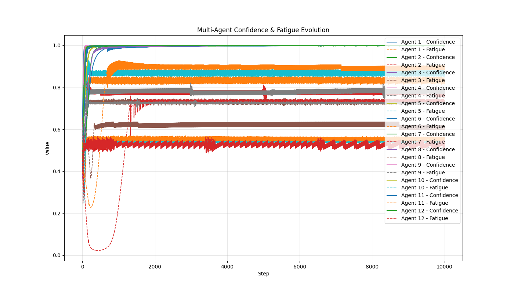  
  **Figure 9. Cross-agent introspective metrics comparison.**  
  *Displays how introspective variables differ between agents under identical conditions.*

- **Faceted View by Configuration**

  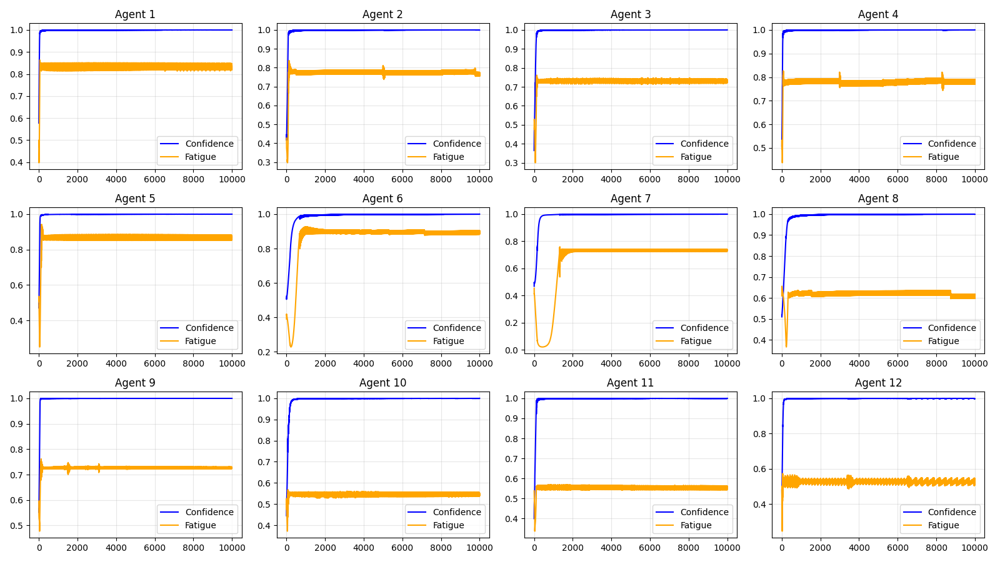  
  **Figure 10. Behavioral dynamics across agent configurations.**  
  *Breakdown of internal state transitions categorized by policy or self-model type.*

- **Mean & Std Confidence Trends**

  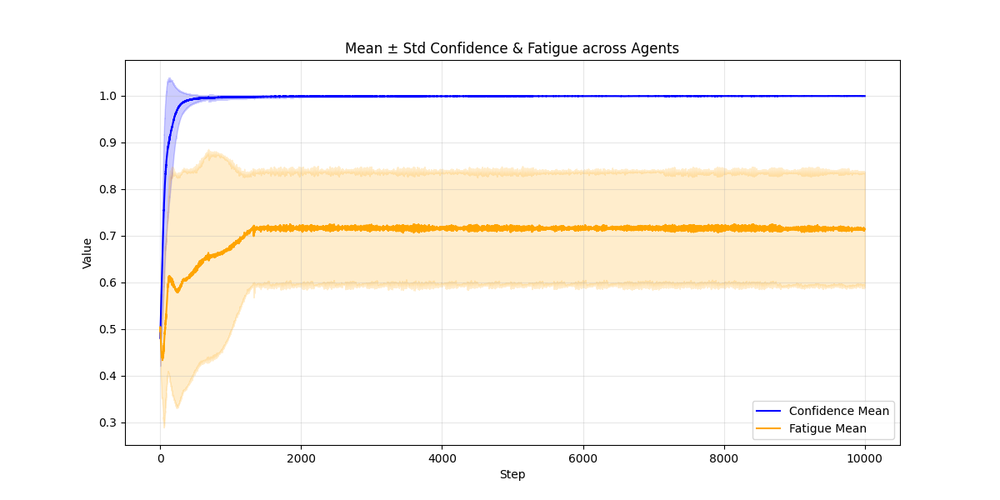  
  **Figure 11. Confidence and fatigue trend analysis with statistical overlays.**  
  *Highlights overall trends and variability across the entire agent population.*

- **Final Agent Metrics Overview**

  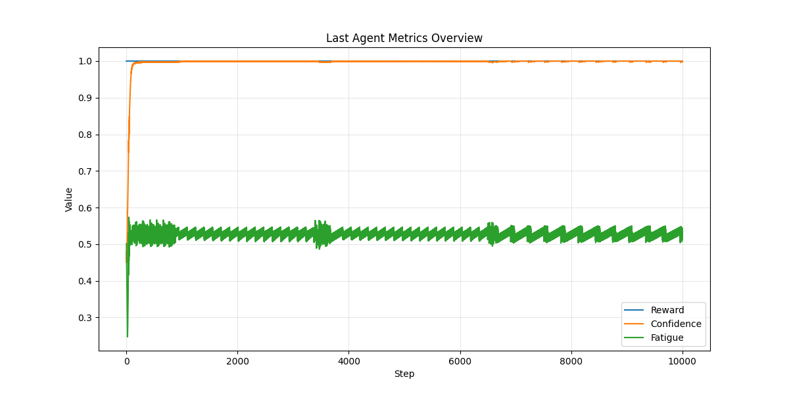  
  **Figure 12. Final internal metrics per agent.**  
  *Bar plots showing summary statistics at the end of each episode for all agents.*

- **Training Loss Convergence**

  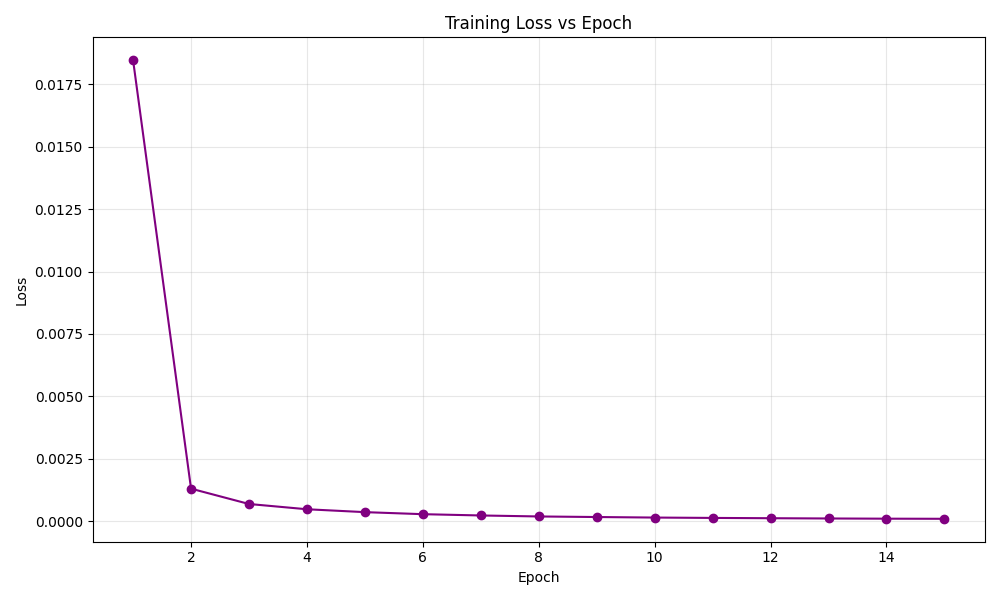  
  **Figure 13. Meta-learner training loss curve.**  
  *Shows how the introspective meta-model converges during training.*

## 3. Installation and Usage

The Self-Modeling Agent Framework is fully open-source and available via Zenodo and GitHub. It is designed for seamless execution in both programmatic and graphical modes, offering flexibility for researchers, educators, and developers.

### 3.1 Setup and Requirements

- **Installation**: Clone the repository and follow the setup steps in the `README.md` file.
- **Dependencies**: The system requires Python 3.9+ and the packages listed in `requirements.txt`.
- **Compatibility**: Works on Linux, macOS, and Windows. GPU support is optional for accelerated training.

### 3.2 Execution Modes

The system can be used in two main ways:

- **Scripted Execution**  
  Advanced users can run experiments directly through modular Python scripts (e.g., `run_gridworld_experiment.py`, ` run_multi_agent_experiment.py`). Each component—agents, self-models, meta-learners—can operate independently.

- **Graphical User Interface (GUI)**  
  For users who prefer a visual interface, the framework includes a dashboard that simplifies configuration and experiment execution without writing code.

### 3.3 Output and Reproducibility

- **Logging**: All runs generate structured logs, internal state traces, and scientific metrics.
- **Export Formats**: Results are saved in CSV, JSON, and visual formats for post-hoc analysis.
- **Reproducibility**: All experiments are fully replicable using the published configurations and included datasets.

### 3.4 Repository and License

- **Code repository version v1.0.0**: [https://doi.org/10.5281/zenodo.15660166](https://doi.org/10.5281/zenodo.15660166)
- **License**: Apache 2.0 – permitting free academic and research use.

> 💡 For full deployment instructions, visual samples, and preconfigured runs, see the official documentation in the repository’s `docs/` folder and refer to the GUI interface (Section 2.5.1).

## 4. Reuse Potential

The Self-Modeling Agent Framework is designed with reusability, extensibility, and scientific integration in mind. Its modular architecture allows researchers and developers to incorporate individual components or the full system into diverse applications across artificial intelligence, cognitive modeling, robotics, and multi-agent systems.

### 4.1 Modular Integration

Each subsystem—agent core, self-monitoring logic, meta-learner, and visualization tools—can be imported and extended independently. This allows:

- Integration of the self-model into existing RL agents  
- Embedding the meta-learner into custom control architectures  
- Reuse of visualization components for other introspective systems

### 4.2 Cross-Domain Applicability

The framework is not limited to a specific environment or task. Potential domains for reuse include:

- **Reinforcement Learning**: Enhance agents with dynamic internal state regulation  
- **Robotics**: Monitor and adapt real-time behaviors via introspective signals  
- **Human-AI Interaction**: Model trust, fatigue, and confidence for explainable agents  
- **Multi-Agent Coordination**: Explore emergent patterns from self-aware populations  
- **AI Safety and Alignment**: Use meta-cognition to analyze misalignment scenarios

### 4.3 Educational Utility

The system has been successfully deployed in academic workshops and AI ethics courses. Its clear structure, real-time dashboards, and reproducible experiments make it ideal for:

- Teaching introspective AI concepts  
- Demonstrating modular software engineering in cognitive architectures  
- Supporting student projects in adaptive agent modeling

### 4.4 Scientific Experimentation

The included tools support rigorous scientific inquiry:

- All internal states are observable and exportable for statistical analysis  
- Experiments can be replicated with identical parameters  
- Outputs are compatible with popular data science and visualization pipelines (e.g., Pandas, Matplotlib, Seaborn)

### 4.5 Future Extensions

Researchers can build on the existing framework to:

- Add new introspective variables (e.g., curiosity, risk tolerance)  
- Swap meta-learners with transformers, GNNs, or neuro-symbolic models  
- Integrate the system into Unity, ROS, or Web-based environments  
- Develop ethical self-modeling simulations for alignment research

---

By enabling both low-level experimentation and high-level system design, the framework provides a fertile foundation for future research in self-aware AI and cognitively adaptive systems.

## Related Literature

[^1]: A. Sloman & R. Chrisley. *Virtual machines and consciousness*. Journal of Consciousness Studies, 10(4–5), 113–172, 2003.[https://www.researchgate.net/publication/233713911_Virtual_Machines_and_Consciousness](https://www.researchgate.net/publication/233713911_Virtual_Machines_and_Consciousness)

[^2]: M. T. Cox. *Metacognition in computation: A selected research review*. Artificial Intelligence, 169(2), 104–141, 2005. [https://doi.org/10.1016/j.artint.2005.10.009](https://doi.org/10.1016/j.artint.2005.10.009)

[^3]: R. Sun. *The importance of cognitive architectures: An analysis based on CLARION*. Journal of Experimental & Theoretical Artificial Intelligence, 19(2), 159–193, 2007. [https://doi.org/10.1080/09528130701191560](https://doi.org/10.1080/09528130701191560)

[^4]: M. Schwaninger. *Intelligent organizations: An integrative framework*. System Dynamics Review, 17(2), 203–214, 2001.[ https://doi.org/10.1002/sres.408]( https://doi.org/10.1002/sres.408)

[^5]: Martius G, Der R, Ay N (2013) Information Driven Self-Organization of Complex Robotic Behaviors. PLoS ONE 8(5): e63400. [https://doi.org/10.1371/journal.pone.0063400](https://doi.org/10.1371/journal.pone.0063400)

[^6]: E. Hoel, L. Albantakis, & G. Tononi. *Quantifying causal emergence shows that macro can beat micro*. Proceedings of the National Academy of Sciences (PNAS), 110(49), 19790–19795, 2013. [https://doi.org/10.1073/pnas.1314922110](https://doi.org/10.1073/pnas.1314922110)

[^7]: M. T. Cox & A. Raja. *Metareasoning: A manifesto*. Artificial Intelligence, 169(1), 1–6, 2005. [https://engfac.cooper.edu/pages/araja/uploads/Manifesto-AAAI-WS-2008.pdf](https://engfac.cooper.edu/pages/araja/uploads/Manifesto-AAAI-WS-2008.pdf)

